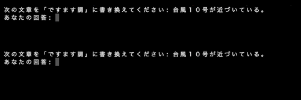

Rephrase Quiz
=============

これはFunction Callingの機能を使い、文章の書き換えを行うクイズに正解していたら青い文字で "正解です！" と表示し、不正解だったら赤い文字で "不正解です。" と表示するサンプルです。

## 使い方

まず、環境変数 `OPENAI_API_KEY` に、[PLaMo β版 トライアル](https://plamo.preferredai.jp/)で申し込みを行なって入手したAPIキーをセットしてください。

```sh
export OPENAI_API_KEY=<YOUR_API_KEY>
```

次に、必要なパッケージをインストールして、サンプルを実行します。

```sh
pip install -r requirements.txt

python main.py
```

問題が表示され、「あなたの回答: 」というプロンプトが出るので、続いて回答を入力してください。
回答は、PLaMoによって自動的に評価され、正解と判断された場合は、 `main.py` の中で定義されている `evaluate_answer` という関数が、 `is_correct` という引数に `True` が渡される形で呼ばれます。
回答が不正解と判断された場合は、 `is_correct` には `False` が渡ります。
いずれにせよ、第2引数には、PLaMoによって生成されたフィードバックの文章が渡されます。

### 実行例

入力した回答が正解か不正かかによって関数へ渡される引数の値が異なるため、それぞれの場合に応じてメッセージの色が変わっています。

